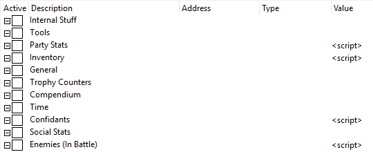
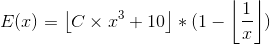

# [RPSC3] Persona 5 Cheat Table

A cheat table for Persona 5, a game developed by Atlus.

For use while playing on RPCS3.

__WARNING:__ Generally untested, use at your own discretion, don't blame me for borked saves, etc.



__NOTE__: The table is mostly dynamically generated, due to some limitations opening certain group records for the first time can take a while.

## Prerequisites

* Latest Cheat Engine version + Big Endian Types.
* Latest RPCS3 master.
* Persona 5. This table has been tested with NPEB02436.

## Installation

1. Download and install Cheat Engine (or use the portable version).
2. Install Big Endian Types in Cheat Engine.
3. Clone or download this repository.

## Usage

1. Open RPCS3 and launch `Persona 5`.
2. Open Cheat Engine and load the cheat table.

### Table Contents

#### Internal Stuff

Internal table records.

#### Tools

Miscellaneous utilities.

##### Experience Calculator

By entering a value in the level field, you can get the _minimal required experience_ to reach that level for a given persona or party member.

See [Experience](#experience) for calculation details.

##### Name Changer

Using this tool, you can change the Hero's first and last name, as well as your group name.

This tool limits you to the available characters for names in the English release of the game as the game might crash when using an invalid character.

##### Compendium Unlocker

Click the checkbox to unlock or lock a persona in the compendium.

__WARNING:__ Locking a persona and then unlocking it would reset all persona stats.

#### Data Structures

Useful data structures in MemoryRecord form.

The _Address_ fields function as offsets, so values (if any) can be ignored.

#### Lists

Various drop-down lists referenced in the table.

#### Party Stats

Edit stats relating to party members:

* _HP, SP:_ Should be obvious.
* _Ailments:_ Various ailment flags.
* _Level, EXP_:
  * Only relevant to the Hero.
  * Use the _Experience Calculator_ in the _Tools_ section to get correct values for these entries.
  * Editing the level is not recommended, instead edit the EXP, then enter and win a battle to initiate the game's level-up process.
  * Party member's level and EXP are tied to their persona's level and EXP.
* _Buff Status_: Flags that determine whether a buff is active or not.
* _Buff Direction_: Determines a buff's direction (e.g. ATK+ or ATK-).
* _Buff Duration_: The amount of turns in which a buff is active.
* _Persona_: A collection of the combatant's persona. Note that only the hero can have more than one persona, however all party members (and enemies) use the same data structure and so the table accounts for that. Available stats for each persona include:

  * _Level, EXP_: Should be obvious. These also represent each party member's (but not the Hero's, see above) Level and EXP.
  * _Skills_: Should be obvious. Entries are tagged, see [Tags](#tags) for more details.
  * _Stats_: Should be obvious.

* _Equip_: Equipped gear. Entries are tagged, see [Tags](#tags) for more details.
* _Bullets:_ Should be obvious.
* _HP Gain, SP Gain_: The HP and SP gained from training. Normally can only be increased by the Hero, however you can set these manually for other party members and their HP and SP will increase accordingly.

#### Inventory

Items are grouped in the table as they are grouped in the game's memory.

Entries are tagged, see [Tags](#tags) for more details.

#### General

Contains various game stats that didn't fit in any other category: Money, Romance, Batting, Training, Fishing and Palace stats.

#### Trophy Counters

Various trophy counters that track when a trophy is unlocked.

__This is particulary helpful to track the progress of the "Passionate Listener" trophy.__ Contrary to popular belief, this trophy only tracks lines spoken _during combat_ using _either navigator_.

#### Compendium

Allows you to edit persona records in the compendium.

You can also unlock or lock persona records using the [Compendium Unlocker](#compendium-unlocker).

#### Time

Allows you to edit time related values.

To repeat a day's first timeslot, during an event, set `Time of Day` to `3`.

To repeat a day's second timeslot, during an event, set `Time of Day` to `5`.

#### Confidants

Allows you to edit both the confidant’s current rank and the confidant's affinity (determines whether the confidant will rank up the next time you meet with them).

Changing a confidant's rank via the table is not recommended, instead change the affinity and then initiate a rank up in game.

#### Social Stats

Edit the Hero's Knowledge, Charm, etc.

Numbers in parentheses indicate how many points are needed to level up a stat per each possible level.

| Stat        | Level 2 | 3  | 4   | 5   |
|-------------|--------:|---:|----:|----:|
| Knowledge   | 34      | 82 | 126 | 192 |
| Charm       | 6       | 52 | 92  | 132 |
| Proficiency | 12      | 34 | 60  | 87  |
| Guts        | 11      | 29 | 57  | 113 |
| Kindness    | 14      | 44 | 91  | 136 |

* 1 note - 2 points.
* 2 notes - 3 points.
* 3 notes - 5 points.

#### Enemies

When in battle, enable this record to view enemy stats.

This record does not auto-update, so you'd have to toggle the record to see newly summoned enemies.

### Notes

#### Persona Stats

The sum of persona stats, depending on level `x` is defined using:

``` text
S(x) = x * 3 + 7 ( = St + Ma + En + Ag + Lu )
```

#### Experience

The in-game relationship between a party member or persona's experience `E` and level `x` can be described using:



``` tex
E(x) = \left \lfloor C \times x^{3} + 10 \right \rfloor * ( 1 - \left \lfloor \frac{1}{x}  \right \rfloor )
```

``` text
E(x) = floor( C * x ^ 3 + 10 ) * ( 1 - floor( 1 / x ) )
```

`C` is the base level coefficient:

* for party members, `C` is always `1.4`.
* for personas, `C` depends on the persona's base level `b` and is calculated using:


``` tex
C(b) = -0.019 \times b + 3.7
```

``` text
C(b) = -0.019 * b + 3.7
```

#### Tags

##### Accessory

* `BLN` - Blank
* `FLR` - Filler
* `DLC*` - Obtained from DLC
* `UNK` - Unknown if valid
* `VAL` - Obtainable item
* `HAW` - Hawaii gift

##### Melee

* `BLN` - Blank
* `FLR` - Filler
* `UNK` - Unknown if valid
* `<ALLY_NAME>` - Can be equipped by...

##### Outfit

* `BLN` - Blank
* `UNK` - Unknown if valid
* `<ALLY_NAME>` - Can be equipped by...

##### Protector

* `BLN` - Blank
* `UNK` - Unknown if valid
* `<TYPE>` - Can be equipped by...
* `DLC*` - Obtained from DLC

##### Ranged

* `BLN` - Blank
* `UNK` - Unknown if valid
* `<ALLY_NAME>` - Can be equipped by...

##### Skill Cards

* `VAL` - Obtainable item
* `BLN` - Blank
* `DLC` - Obtained from DLC
* `INV` - Invalid item
* `FLR` - Filler
* `UNO` - Valid but unobtainable

##### Key & Palace

* `BLN` - Blank
* `FLR` - Filler
* `UNK` - Unknown if valid
* `IWAI` - Special confidant item
* `FUSE` - Fusion enabler
* `BOSS` - Boss gift
* `XMAS` - Christmas gift
* `CNF` - Confidant gift
* `PAL` - Palace item

##### Consumables & Essentials

* `BLN` - Blank
* `FLR` - Filler
* `UNK` - Unknown if valid
* `BOOK` ,`DVD`, `TOOL`, `GAME`, `GIFT`, `FISH`, `FISH*` - Should be obvious
* `DEC` - Room decoration
* `CAP` - Capsule game reward
* `REW` - Game reward
* `MAT` - Tool materials
* `ITM`, `ITM*` - Misc. item
* `HP`, `BUFF`, `HP+BUFF`, `HP+CURE`, `HP+SP`, `SP`, `SP+BUFF`, `CURE` - Should be obvious
* `IN` - Can be used only _in battle_
* `OUT` - Can be used only _out of battle_
* `BTH` - Can be used _anytime_
* `REV` - Revival item
* `SHI` - Shield item
* `VLN` - Valentine's gift
* `DMG` - Damage dealing item
* `FES` - Festival gift

##### Treasure

* `BLN` - Blank
* `VAL` - Obtainable item
* `UNK` - Unknown if valid
* `FLR` - Filler

##### Arcana

* `BLN` - Blank
* `UNK` - Unknown if valid
* `FLR` - Filler
* `VAL` - Valid arcana

##### Persona

* `BLN` - Blank
* `INV` - Invalid persona
* `DLC` - DLC exclusive persona
* `DUP` - Duplicate persona
* `FLR` - Filler
* `<ALLY_NAME>` - Valid persona, carried by...

##### Skills

* `BLN` - Blank
* `NET` - Network fusion skill
* `UNO` - Valid but unobtainable skill
* `FUT` - Futaba skill
* `DLC` - DLC exclusive skill
* `LCK` - Lockdown exclusive skill
* `DUP` - Duplicate skill
* `FLR` - Filler
* `VAL` - Obtainable skill
* `INV` - Invalid skill
